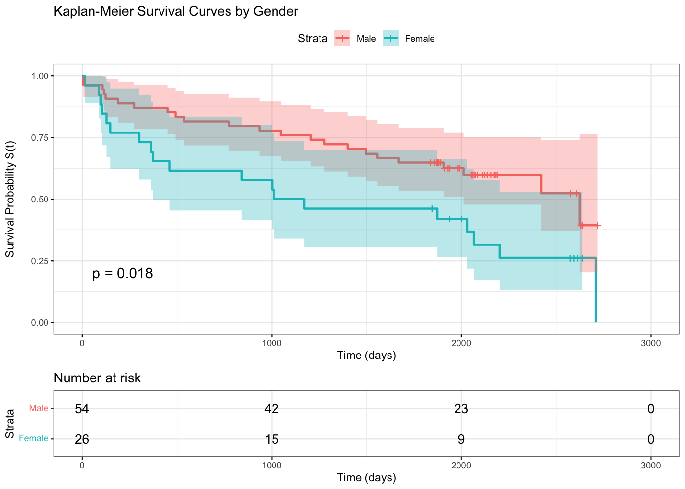
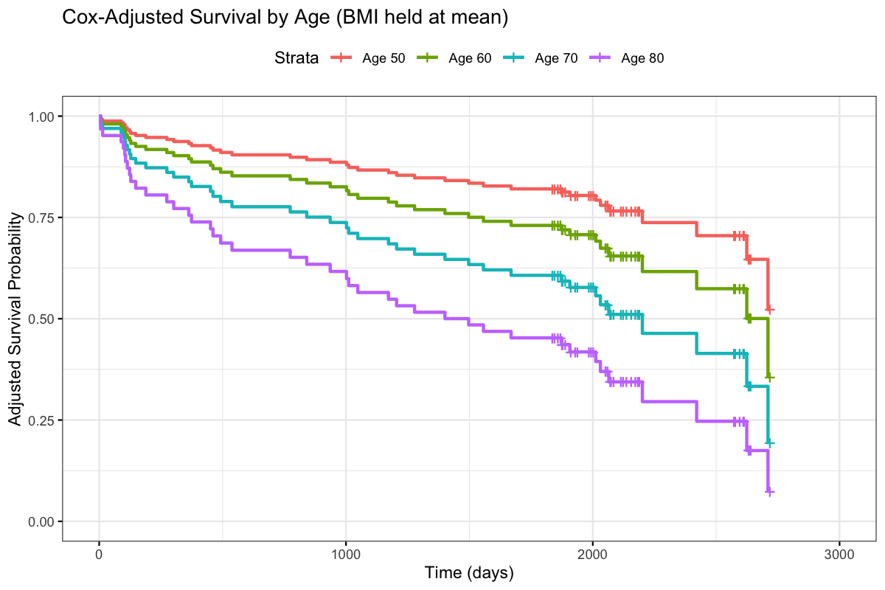

# Survival Analysis & Cox Regression in R

## Overview

This project applies survival-analysis methods to time-to-event data to investigate differences in survival experience and quantify the effects of age and BMI on mortality risk.

The analysis uses Kaplan-Meier estimation, log-rank testing and Cox proportional hazards models, including interaction terms to test whether the effects of age and BMI differ by gender.

## Methods

- Kaplan-Meier survival estimation
- Log-rank testing
- Cox proportional hazards regression
- Hazard-ratio interpretation
- Likelihood-ratio model comparison
- Gender-by-age and gender-by-BMI interaction modelling
- Adjusted survival curves at representative covariate values

## Key Findings

## Selected Visualisations

### Kaplan-Meier Survival Curves by Gender

Kaplan-Meier estimates were used to compare survival experience between males and females, with confidence intervals and a number-at-risk table included to show uncertainty and the number of observations remaining under follow-up.

### Cox-Adjusted Survival by Age

Adjusted survival curves from the Cox proportional hazards model illustrate the effect of age while holding BMI at its sample mean. Predicted survival decreases as age at admission increases.

- Age was statistically significant in the fitted Cox model.
- The estimated age hazard ratio was **1.047**, corresponding to an estimated **4.7% increase in hazard per additional year of age**, holding BMI fixed.
- BMI was not statistically significant after controlling for age.
- The interaction likelihood-ratio test returned **p = 0.249**, providing no strong evidence that the effects of age and BMI differed by gender.

## Tools

**R | Survival Analysis | Kaplan-Meier | Cox Regression | Statistical Modelling | Model Interpretation**

## Data

The original analysis used an Excel dataset supplied for MSc coursework. The dataset is not included in this repository.

To reproduce the analysis with an authorised copy of the data, place `midata.xlsx` in the repository root before running `survival_analysis.R`.

## Project Context

This repository is a portfolio adaptation of collaborative coursework completed during the MSc Actuarial Science programme at Bayes Business School.

The repository presents a cleaned, recruiter-facing version of the analysis and does not claim sole authorship of the original group submission.
